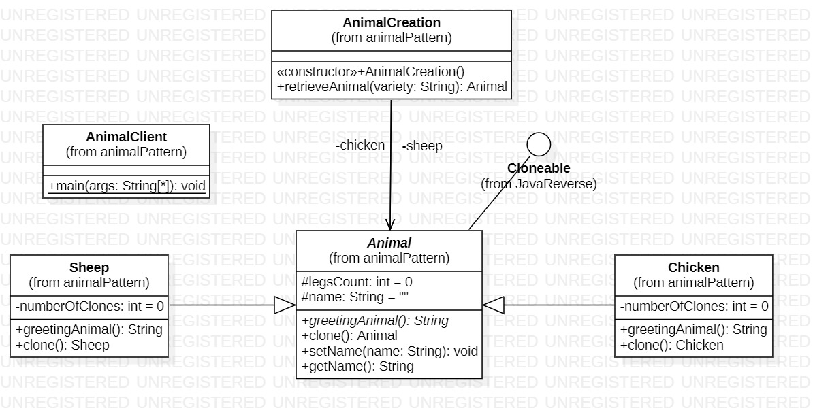
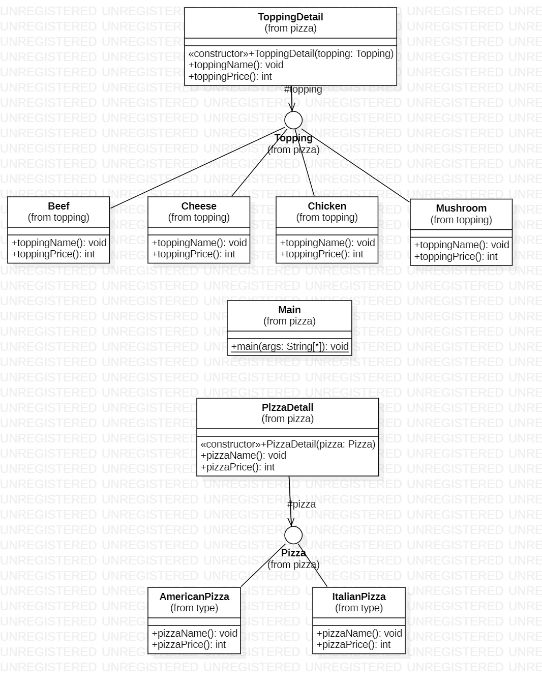

# Tugas PPL Kelas B - Design Pattern

Anggota Kelompok

- Husin Muhammad Assegaff (05111940000127)
- Abdurrahman Fauzan F (05111940000231)
- Afifan Syafaqi Yahya (05111940000234)

---

## Problem 1

Buatlah implementasi program berorientasi obyek untuk studi kasus "Animal Farm". Di dalamnya bisa dibuat beberapa instance Sheep dan Chicken. Misal 4 sheep dan 6 chicken.

### Class Diagram

## Source Code

Solusi kelompok kami, [klik disini](https://github.com/husinassegaff/ppl-assignment-week-11/tree/main/src/com/animalPattern)

## Problem 2

Buatlah implementasi program berorientasi obyek untuk studi kasus "Pizza". Di dalamnya bisa dibuat beberapa pizza dengan topping yang berbeda.

### Class Diagram

### Source Code

Solusi kelompok kami, [klik disini](https://github.com/husinassegaff/ppl-assignment-week-11/tree/main/src/com/pizza)
